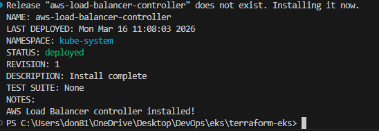
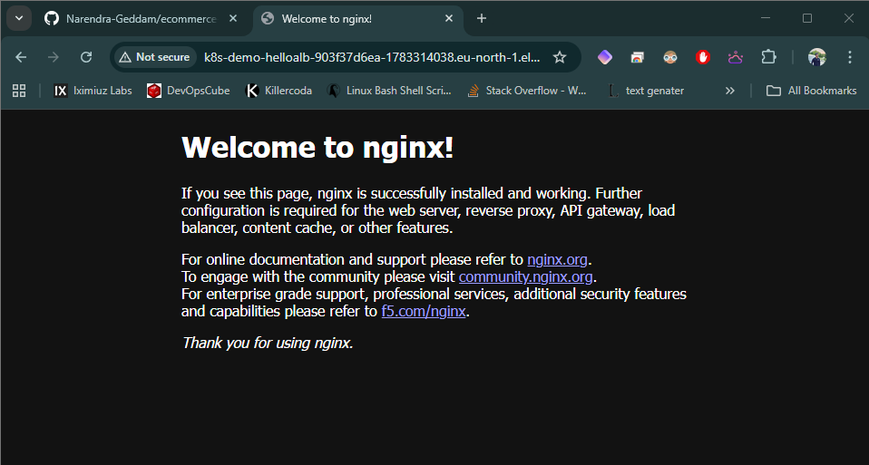

# AWS ALB (AWS Load Balancer Controller) on EKS

This guide shows how to set up an Application Load Balancer (ALB) for Kubernetes Ingress on an EKS cluster using the AWS Load Balancer Controller. It includes the required IAM, Helm install, and a sample Ingress.

---

## Prerequisites

- An EKS cluster is running
- kubectl configured for the cluster
- AWS CLI configured with permissions to manage IAM and EKS
- Helm installed
- The cluster has an OIDC provider enabled (IRSA)

Tools to have on your machine:
- aws
- kubectl
- helm
- eksctl (recommended for IRSA creation)

---

## Variables (set these first)

Linux/macOS (bash):

```bash
export AWS_REGION=eu-north-1
export CLUSTER_NAME=my-eks-cluster
export ACCOUNT_ID=$(aws sts get-caller-identity --query Account --output text)
```

Windows (PowerShell):

```powershell
$env:AWS_REGION = "eu-north-1"
$env:CLUSTER_NAME = "my-eks-cluster"
$env:ACCOUNT_ID = (aws sts get-caller-identity --query Account --output text)
```

Optional, if you want to set VPC manually:

Linux/macOS (bash):

```bash
export VPC_ID=$(aws eks describe-cluster --name $CLUSTER_NAME --region $AWS_REGION --query "cluster.resourcesVpcConfig.vpcId" --output text)
```

Windows (PowerShell):

```powershell
$env:VPC_ID = (aws eks describe-cluster --name $env:CLUSTER_NAME --region $env:AWS_REGION --query "cluster.resourcesVpcConfig.vpcId" --output text)
```

---

## Step 1: Configure kubectl for the cluster

Linux/macOS (bash):

```bash
aws eks update-kubeconfig --region $AWS_REGION --name $CLUSTER_NAME
kubectl get nodes
```

Windows (PowerShell):

```powershell
aws eks update-kubeconfig --region $env:AWS_REGION --name $env:CLUSTER_NAME
kubectl get nodes
```

---

## Step 2: Ensure OIDC provider is enabled (IRSA)

Check if the OIDC provider is already associated:

Linux/macOS (bash):

```bash
aws eks describe-cluster --name $CLUSTER_NAME --region $AWS_REGION --query "cluster.identity.oidc.issuer" --output text
```

Windows (PowerShell):

```powershell
aws eks describe-cluster --name $env:CLUSTER_NAME --region $env:AWS_REGION --query "cluster.identity.oidc.issuer" --output text
```

If you do not see an issuer URL, create one with eksctl:

Linux/macOS (bash):

```bash
eksctl utils associate-iam-oidc-provider --region $AWS_REGION --cluster $CLUSTER_NAME --approve
```

Windows (PowerShell):

```powershell
eksctl utils associate-iam-oidc-provider --region $env:AWS_REGION --cluster $env:CLUSTER_NAME --approve
```

---

## Step 3: Create the IAM policy for the controller

Download the official IAM policy JSON and create the policy:

Linux/macOS (bash):

```bash
curl -o iam_policy.json https://raw.githubusercontent.com/kubernetes-sigs/aws-load-balancer-controller/main/docs/install/iam_policy.json
aws iam create-policy --policy-name AWSLoadBalancerControllerIAMPolicy --policy-document file://iam_policy.json
```

Windows (PowerShell):

```powershell
Invoke-WebRequest -Uri https://raw.githubusercontent.com/kubernetes-sigs/aws-load-balancer-controller/main/docs/install/iam_policy.json -OutFile iam_policy.json
aws iam create-policy --policy-name AWSLoadBalancerControllerIAMPolicy --policy-document file://iam_policy.json
```

If the policy already exists, capture its ARN:

Linux/macOS (bash):

```bash
export LBC_POLICY_ARN=arn:aws:iam::$ACCOUNT_ID:policy/AWSLoadBalancerControllerIAMPolicy
```

Windows (PowerShell):

```powershell
$env:LBC_POLICY_ARN = "arn:aws:iam::$env:ACCOUNT_ID:policy/AWSLoadBalancerControllerIAMPolicy"
```

---

## Step 4: Create IAM service account (IRSA)

Using eksctl (recommended):

Linux/macOS (bash):

```bash
eksctl create iamserviceaccount \
  --cluster $CLUSTER_NAME \
  --namespace kube-system \
  --name aws-load-balancer-controller \
  --attach-policy-arn $LBC_POLICY_ARN \
  --approve
```

Windows (PowerShell):

```powershell
eksctl create iamserviceaccount `
  --cluster $env:CLUSTER_NAME `
  --namespace kube-system `
  --name aws-load-balancer-controller `
  --attach-policy-arn $env:LBC_POLICY_ARN `
  --approve
```

This creates a Kubernetes service account with the correct IAM role.

---

## Step 5: Install the AWS Load Balancer Controller with Helm

Linux/macOS (bash):

```bash
helm repo add eks https://aws.github.io/eks-charts
helm repo update

helm upgrade --install aws-load-balancer-controller eks/aws-load-balancer-controller \
  --namespace kube-system \
  --set clusterName=$CLUSTER_NAME \
  --set serviceAccount.create=false \
  --set serviceAccount.name=aws-load-balancer-controller \
  --set region=$AWS_REGION \
  --set vpcId=$VPC_ID
```

Windows (PowerShell):

```powershell
helm repo add eks https://aws.github.io/eks-charts
helm repo update

helm upgrade --install aws-load-balancer-controller eks/aws-load-balancer-controller `
  --namespace kube-system `
  --set clusterName=$env:CLUSTER_NAME `
  --set serviceAccount.create=false `
  --set serviceAccount.name=aws-load-balancer-controller `
  --set region=$env:AWS_REGION `
  --set vpcId=$env:VPC_ID
```

If you did not set `VPC_ID`, remove the `--set vpcId` line. The controller can auto-discover the VPC from the cluster.

Verify the controller is running:

Linux/macOS (bash):

```bash
kubectl -n kube-system get deployment aws-load-balancer-controller
kubectl -n kube-system get pods | grep aws-load-balancer-controller
```

Windows (PowerShell):

```powershell
kubectl -n kube-system get deployment aws-load-balancer-controller
kubectl -n kube-system get pods | findstr aws-load-balancer-controller
```

Example successful Helm install:



---

## Step 6: Subnet tagging requirements

ALB requires subnets tagged so it knows where to place load balancers.

Public subnets (internet-facing):

```
Key: kubernetes.io/role/elb
Value: 1
```

Private subnets (internal):

```
Key: kubernetes.io/role/internal-elb
Value: 1
```

All subnets used by the cluster should also have:

```
Key: kubernetes.io/cluster/$CLUSTER_NAME
Value: shared
```

If you use this Terraform project, these tags are usually created by the VPC module. Verify in AWS console or with CLI.

---

## Step 7: Deploy a sample app and Ingress

Create a namespace and deploy a simple service:

Linux/macOS (bash):

```bash
kubectl create namespace demo

kubectl -n demo apply -f - <<'EOF'
apiVersion: apps/v1
kind: Deployment
metadata:
  name: hello
spec:
  replicas: 2
  selector:
    matchLabels:
      app: hello
  template:
    metadata:
      labels:
        app: hello
    spec:
      containers:
      - name: hello
        image: public.ecr.aws/nginx/nginx:latest
        ports:
        - containerPort: 80
---
apiVersion: v1
kind: Service
metadata:
  name: hello
spec:
  type: ClusterIP
  selector:
    app: hello
  ports:
  - port: 80
    targetPort: 80
EOF
```

Windows (PowerShell):

```powershell
kubectl create namespace demo

@"
apiVersion: apps/v1
kind: Deployment
metadata:
  name: hello
spec:
  replicas: 2
  selector:
    matchLabels:
      app: hello
  template:
    metadata:
      labels:
        app: hello
    spec:
      containers:
      - name: hello
        image: public.ecr.aws/nginx/nginx:latest
        ports:
        - containerPort: 80
---
apiVersion: v1
kind: Service
metadata:
  name: hello
spec:
  type: ClusterIP
  selector:
    app: hello
  ports:
  - port: 80
    targetPort: 80
"@ | kubectl -n demo apply -f -
```

Create an Ingress that provisions an ALB:

Linux/macOS (bash):

```bash
kubectl -n demo apply -f - <<'EOF'
apiVersion: networking.k8s.io/v1
kind: Ingress
metadata:
  name: hello-alb
  annotations:
    kubernetes.io/ingress.class: alb
    alb.ingress.kubernetes.io/scheme: internet-facing
    alb.ingress.kubernetes.io/target-type: ip
spec:
  rules:
  - http:
      paths:
      - path: /
        pathType: Prefix
        backend:
          service:
            name: hello
            port:
              number: 80
EOF
```

Windows (PowerShell):

```powershell
@"
apiVersion: networking.k8s.io/v1
kind: Ingress
metadata:
  name: hello-alb
  annotations:
    kubernetes.io/ingress.class: alb
    alb.ingress.kubernetes.io/scheme: internet-facing
    alb.ingress.kubernetes.io/target-type: ip
spec:
  rules:
  - http:
      paths:
      - path: /
        pathType: Prefix
        backend:
          service:
            name: hello
            port:
              number: 80
"@ | kubectl -n demo apply -f -
```

Check the ALB address:

Linux/macOS (bash):

```bash
kubectl -n demo get ingress
```

Windows (PowerShell):

```powershell
kubectl -n demo get ingress
```

It can take a few minutes to provision. Once the ADDRESS is present, open it in a browser.

Success output (example):



---

## Common issues and fixes

- Ingress stuck in "pending":
  - Check subnets are tagged correctly
  - Ensure the controller pod is running
  - Verify the service account has the correct IAM role

- Access denied errors in controller logs:
  - Ensure the IAM policy is attached to the IRSA role
  - Re-check the controller uses the correct service account

- ALB not created:
  - Confirm `kubernetes.io/ingress.class: alb` annotation
  - Ensure the controller is installed in kube-system

- `aws eks update-kubeconfig --region $AWS_REGION` fails on Windows:
  - PowerShell does not expand `bash` variables. Use `$env:AWS_REGION` and `$env:CLUSTER_NAME`, or set plain PowerShell variables and use them consistently.

- `eksctl` not recognized on Windows:
  - `eksctl` is not installed or not in PATH. Install via Admin PowerShell + Chocolatey, or use Scoop, or install manually and add to PATH.

- `eksctl create iamserviceaccount` fails with:
  - `ARN arn:aws:iam::/AWSLoadBalancerControllerIAMPolicy is not valid`
  - Root cause: the policy ARN variable was empty, so the account ID was missing.
  - Fix:
    - Ensure `$env:ACCOUNT_ID` is set, then build the ARN:  
      `arn:aws:iam::ACCOUNT_ID:policy/AWSLoadBalancerControllerIAMPolicy`
    - If a bad CloudFormation stack exists, disable termination protection, delete the stack, then re-run `eksctl create iamserviceaccount` with the correct ARN.
  - Example PowerShell fix:
    ```powershell
    $env:ACCOUNT_ID = (aws sts get-caller-identity --query Account --output text)
    $env:LBC_POLICY_ARN = "arn:aws:iam::$env:ACCOUNT_ID:policy/AWSLoadBalancerControllerIAMPolicy"

    $STACK_NAME = "eksctl-$env:CLUSTER_NAME-addon-iamserviceaccount-kube-system-aws-load-balancer-controller"
    aws cloudformation update-termination-protection --stack-name $STACK_NAME --no-enable-termination-protection
    aws cloudformation delete-stack --stack-name $STACK_NAME
    aws cloudformation wait stack-delete-complete --stack-name $STACK_NAME

    eksctl create iamserviceaccount `
      --cluster $env:CLUSTER_NAME `
      --namespace kube-system `
      --name aws-load-balancer-controller `
      --attach-policy-arn $env:LBC_POLICY_ARN `
      --approve
    ```

View controller logs:

Linux/macOS (bash):

```bash
kubectl -n kube-system logs deployment/aws-load-balancer-controller
```

Windows (PowerShell):

```powershell
kubectl -n kube-system logs deployment/aws-load-balancer-controller
```

---

## Cleanup

Linux/macOS (bash):

```bash
kubectl -n demo delete ingress hello-alb
kubectl -n demo delete svc hello
kubectl -n demo delete deployment hello
kubectl delete namespace demo
```

Windows (PowerShell):

```powershell
kubectl -n demo delete ingress hello-alb
kubectl -n demo delete svc hello
kubectl -n demo delete deployment hello
kubectl delete namespace demo
```

If you want to remove the controller:

Linux/macOS (bash):

```bash
helm -n kube-system uninstall aws-load-balancer-controller
```

Windows (PowerShell):

```powershell
helm -n kube-system uninstall aws-load-balancer-controller
```
